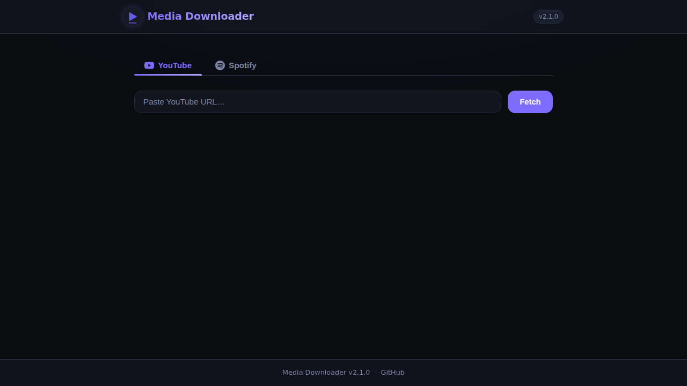
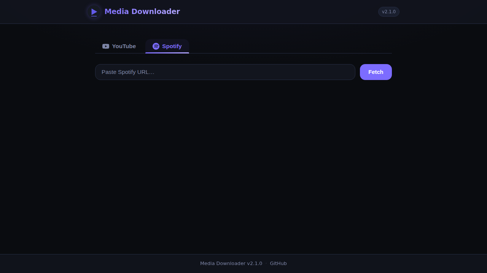

# Media Downloader

[](LICENSE)
[](https://python.org)
[](Dockerfile)

> **YouTube + Spotify downloader** — dark‑themed web app that streams files to your browser. Files are downloaded to temporary server-side storage and automatically deleted after the transfer completes.

---

## ✨ Features

| Feature | Details |
|---------|---------|
| **YouTube** | Paste URL → preview card → choose 360p / 480p / 720p / 1080p / 1440p / 2160p (4K) or MP3 / FLAC → stream to browser |
| **Spotify** | Paste track/album/playlist URL → preview card → choose MP3 or FLAC → stream MP3/FLAC or ZIP (playlists) |
| **Temp storage** | Downloads are saved to temporary server-side files (with metadata & thumbnail embedded), streamed to browser, then deleted |
| **Dark UI** | Custom CSS with glassmorphism, responsive layout, animated progress bars, toast notifications |
| **Lightweight** | Runs on 1 CPU / 512 MB RAM (Proxmox LXC or any small VPS) |
| **Rate limited** | Built-in per-IP rate limiting to prevent abuse |

---

## 📸 Screenshots

| YouTube tab | Spotify tab |
|:-----------:|:-----------:|
|  |  |

---

## 📋 Requirements

### System dependencies

| Dependency | Purpose | Install |
|------------|---------|---------|
| **Python 3.10+** | Runtime | [python.org](https://python.org) |
| **ffmpeg** | Audio/video conversion used by yt-dlp and spotdl | see below |
| **git** | Cloning the repository | [git-scm.com](https://git-scm.com) |

**Install ffmpeg:**

| OS | Command |
|----|---------|
| Windows | `winget install ffmpeg` or `choco install ffmpeg` |
| macOS | `brew install ffmpeg` |
| Debian/Ubuntu | `sudo apt install ffmpeg` |
| Fedora/RHEL | `sudo dnf install ffmpeg` |
| Arch Linux | `sudo pacman -S ffmpeg` |

### Python dependencies

Installed automatically via `pip install -r requirements.txt`.

---

## 🐳 Docker

<details>
<summary>Click to expand Docker instructions</summary>

```bash
# Build
docker build -t media-downloader .

# Run
docker run -d \
  --name media-downloader \
  -p 8080:8080 \
  -e SECRET_KEY="$(openssl rand -hex 32)" \
  media-downloader
```

### Docker Compose

Create a `docker-compose.yml`:

```yaml
services:
  media-downloader:
    build: .
    ports:
      - "8080:8080"
    environment:
      - SECRET_KEY=change-me-to-a-random-string
    restart: unless-stopped
```

Then run:

```bash
docker compose up -d
```

</details>

---

## 🚀 Proxmox LXC Install

<details>
<summary>Click to expand Proxmox LXC instructions</summary>

### Before You Run

Check these settings in `install.sh` and change any that don't match your Proxmox setup:

| Variable | Default | What to change |
|----------|---------|----------------|
| `CT_BRIDGE` | `vmbr0` | Your Proxmox network bridge. Run `ip link` on the node to list bridges |
| `CT_STORAGE` | `local-lvm` | Storage pool for the container disk. Run `pvesm status` to list available pools |
| `CT_TEMPLATE_STORAGE` | `local` | Where LXC templates are stored |
| `CT_RAM` | `512` MB | Increase to `1024` if you plan heavy playlist downloads |
| `CT_DISK` | `4` GB | Increase if you need more scratch space (files are streamed then deleted, so 4 GB is usually fine) |

### Run the Installer

Run this **on the Proxmox node shell** (not inside a container):

```bash
bash -c "$(wget -qO- https://raw.githubusercontent.com/0-exe/media-dowlnoader/main/install.sh)"
```

The script will:
1. Find the next free CT ID (starting at 200)
2. Download a Debian 12 LXC template (if not already present)
3. Create an unprivileged container with nesting enabled (1 CPU, 512 MB RAM, 4 GB disk, DHCP)
4. Run `setup.sh` inside the container — installs all dependencies and creates a `systemd` service
5. Print the container ID and access URL: `http://<CONTAINER_IP>:8080`

### After the Installer Finishes

**1. Open the web UI**

Navigate to the URL printed at the end of the installer in any browser:
```
http://<CONTAINER_IP>:8080
```

If you don't see the IP, run this on the Proxmox node:
```bash
pct exec <CTID> -- hostname -I
```

---

**2. Enter the container shell**

For all configuration and management tasks below, first open a shell **inside the container**:

```bash
# Run on the Proxmox node to open a shell inside the LXC
pct enter <CTID>
```

You are now inside the container. All the commands in the sections below are run here.

---

**3. (Optional) Set a persistent secret key**

By default a random `SECRET_KEY` is generated at every startup, so browser sessions are lost when the service restarts. To set a permanent key, open a drop-in override editor:

```bash
# Inside the container shell:
systemctl edit media-downloader
```

The editor opens an empty override file. Enter the following (see [`docs/systemd-override.example.conf`](docs/systemd-override.example.conf) for all available options):

```ini
[Service]
Environment="SECRET_KEY=replace-with-a-long-random-string"
```

> **Tip:** Generate a secure value with `openssl rand -hex 32`.

Save and close the editor, then apply the change:

```bash
# Inside the container shell:
systemctl daemon-reload
systemctl restart media-downloader
```

---

**4. Check the service status**

```bash
# Inside the container shell:
systemctl status media-downloader

# Follow live logs:
journalctl -u media-downloader -f

# View the last 50 log lines:
journalctl -u media-downloader -n 50
```

---

**5. Update the application**

The installer provides a single `update` command that pulls the latest code, updates all dependencies (yt-dlp, spotdl, Python packages), and restarts the service:

```bash
# Inside the container shell:
update
```

---

**6. Keep `yt-dlp` up to date**

YouTube changes frequently. If downloads suddenly stop working, update `yt-dlp`:

```bash
# Inside the container shell:
yt-dlp -U
```

---

**7. Manage the container** *(run on the Proxmox node)*

```bash
# Stop the container
pct stop <CTID>

# Start the container
pct start <CTID>

# Open a shell inside the container
pct enter <CTID>

# Restart just the app service without entering the container
pct exec <CTID> -- systemctl restart media-downloader
```

</details>

---

## 🛠 Manual Install

<details>
<summary>Windows</summary>

```powershell
# 1. Install system dependencies (run in an elevated PowerShell or use winget/choco)
winget install Python.Python.3.12
winget install ffmpeg
winget install Git.Git

# 2. Restart your terminal so PATH changes take effect, then clone the repo
git clone https://github.com/0-exe/media-dowlnoader.git
cd media-dowlnoader

# 3. Create and activate a virtual environment
python -m venv .venv
.venv\Scripts\activate

# 4. Install Python dependencies
pip install -r requirements.txt

# 5. Start the server
python app.py
```

Open **http://localhost:8080** in your browser.

</details>

<details>
<summary>macOS</summary>

```bash
# 1. Install Homebrew (if not already installed)
/bin/bash -c "$(curl -fsSL https://raw.githubusercontent.com/Homebrew/install/HEAD/install.sh)"

# 2. Install system dependencies
brew install python ffmpeg git

# 3. Clone the repository
git clone https://github.com/0-exe/media-dowlnoader.git
cd media-dowlnoader

# 4. Create and activate a virtual environment
python3 -m venv .venv
source .venv/bin/activate

# 5. Install Python dependencies
pip install -r requirements.txt

# 6. Start the server
python app.py
```

Open **http://localhost:8080** in your browser.

</details>

<details>
<summary>Debian / Ubuntu</summary>

```bash
# 1. Install system dependencies
sudo apt update && sudo apt install -y python3 python3-pip python3-venv ffmpeg git

# 2. Clone the repository
git clone https://github.com/0-exe/media-dowlnoader.git
cd media-dowlnoader

# 3. Create and activate a virtual environment
python3 -m venv .venv
source .venv/bin/activate

# 4. Install Python dependencies
pip install -r requirements.txt

# 5. Start the server
python3 app.py
```

Open **http://localhost:8080** in your browser.

Or use the automated setup script on any Debian/Ubuntu machine:

```bash
curl -fsSL https://raw.githubusercontent.com/0-exe/media-dowlnoader/main/setup.sh | sudo bash
```

</details>

<details>
<summary>Fedora / RHEL / Rocky Linux</summary>

```bash
# 1. Install system dependencies
sudo dnf install -y python3 python3-pip ffmpeg git

# 2. Clone the repository
git clone https://github.com/0-exe/media-dowlnoader.git
cd media-dowlnoader

# 3. Create and activate a virtual environment
python3 -m venv .venv
source .venv/bin/activate

# 4. Install Python dependencies
pip install -r requirements.txt

# 5. Start the server
python3 app.py
```

Open **http://localhost:8080** in your browser.

</details>

<details>
<summary>Arch Linux</summary>

```bash
# 1. Install system dependencies
sudo pacman -S python python-pip ffmpeg git

# 2. Clone the repository
git clone https://github.com/0-exe/media-dowlnoader.git
cd media-dowlnoader

# 3. Create and activate a virtual environment
python3 -m venv .venv
source .venv/bin/activate

# 4. Install Python dependencies
pip install -r requirements.txt

# 5. Start the server
python3 app.py
```

Open **http://localhost:8080** in your browser.

</details>

---

## ⚙️ Environment Variables

<details>
<summary>Click to expand</summary>

| Variable | Default | Description |
|----------|---------|-------------|
| `SECRET_KEY` | *(random)* | Flask secret key. **Set this in production** — a random key is generated on startup if not provided, but sessions will not survive restarts. |
| `APP_PORT` | `8080` | Port the web server listens on. |

</details>

---

## 📡 API Reference

<details>
<summary>Click to expand</summary>

| Method | Endpoint | Description |
|--------|----------|-------------|
| `GET` | `/` | Web UI |
| `GET` | `/api/health` | Health check — returns `{"status":"ok","version":"..."}` |
| `POST` | `/api/youtube/info` | Fetch YouTube video metadata. Body: `{"url": "..."}` |
| `GET` | `/api/youtube/download` | Stream YouTube download. Params: `url`, `format` (360p/480p/720p/1080p/1440p/2160p/mp3/flac) |
| `POST` | `/api/spotify/info` | Fetch Spotify metadata. Body: `{"url": "..."}` |
| `GET` | `/api/spotify/download` | Stream Spotify track or collection. Params: `url`, `format` (mp3/flac) |

### Rate Limits

| Endpoint | Limit |
|----------|-------|
| `/api/youtube/info` | 30 requests / minute |
| `/api/youtube/download` | 10 requests / minute |
| `/api/spotify/info` | 20 requests / minute |
| `/api/spotify/download` | 5 requests / minute |
| All other endpoints | 200 / day, 50 / hour |

### Example — YouTube info

```bash
curl -s -X POST http://localhost:8080/api/youtube/info \
  -H 'Content-Type: application/json' \
  -d '{"url":"https://www.youtube.com/watch?v=dQw4w9WgXcQ"}' | jq .
```

### Example — Health check

```bash
curl -s http://localhost:8080/api/health | jq .
# {"status": "ok", "version": "2.1.0"}
```

</details>

---

## 🗂 Project Structure

<details>
<summary>Click to expand</summary>

```
media-dowlnoader/
├── app.py              # Flask backend
├── Dockerfile          # Docker image definition
├── requirements.txt    # Python dependencies
├── install.sh          # Proxmox LXC one-liner (run on the Proxmox node)
├── setup.sh            # In-container setup (installs deps + systemd)
├── update.sh           # In-container update (pulls code, updates deps, restarts service)
├── docs/
│   └── systemd-override.example.conf   # Example systemd drop-in for env vars
├── static/
│   ├── css/style.css   # Dark-themed responsive CSS
│   ├── js/app.js       # Frontend logic
│   └── img/logo.svg    # Application logo
├── templates/
│   └── index.html      # Single-page Jinja2 template
└── LICENSE
```

</details>

---

## 🔧 Troubleshooting

<details>
<summary>Click to expand</summary>

| Problem | Fix |
|---------|-----|
| `ffmpeg` not found | Install ffmpeg for your OS — see [Requirements](#-requirements) above |
| `yt-dlp` returns errors | Run `yt-dlp -U` to update to the latest version |
| Spotify 401 / auth errors | `spotdl` may need a Spotify developer token — see [spotdl docs](https://spotdl.readthedocs.io/) |
| Container has no internet | Check `CT_BRIDGE` in `install.sh` matches your Proxmox bridge (`ip link` on the node) |
| Can't reach the UI | Make sure the container is running (`pct status <CTID>`) and confirm the IP with `pct exec <CTID> -- hostname -I` |
| Port 8080 already in use | Set `APP_PORT` via `systemctl edit media-downloader` (see [`docs/systemd-override.example.conf`](docs/systemd-override.example.conf)) |
| Service won't start | Run `journalctl -u media-downloader -n 50` |
| Sessions lost after restart | Set a persistent `SECRET_KEY` via `systemctl edit media-downloader` (see [Proxmox step 3](#3-optional-set-a-persistent-secret-key)) |
| SECRET_KEY warning in logs | Set the `SECRET_KEY` environment variable — see [`docs/systemd-override.example.conf`](docs/systemd-override.example.conf) |
| Wrong storage pool error | Change `CT_STORAGE` in `install.sh` to match your pool (`pvesm status` lists them) |

</details>

---

## 📜 License

[MIT](LICENSE) ©2026 0-exe
